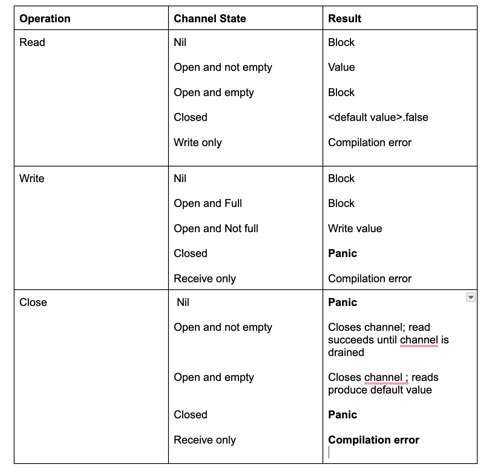

# Channels

-  Like a river , channel serves as conduit for a stream of information, values may be passed along the channel and then read out on the downstream.

- For this reason usually ``chan`` variables with the word ``Stream``.


## Unidirectional Channel

```go
    var dataStream chan interface{}

    dataStream = make(chan interface{})
```

## Read only channel

```go
var dataStream <- chan interface{}
dataStream = make(<- chan interface{})
```

## Write only channel

```go
var dataStream  chan <- interface{}
dataStream = make(chan <- interface{})
```

- We don't often see unidirectional channels instantiated , but we often see them used as ``func params`` and return types. Go will implicitly convert bidirection channels  to unidirectional when needed.

Example

```go
    var recieveChan <- chan interface{}
    var sendChan chan <- interface{}

    dataStream := make(chan interface{})
    
    // valid statements

    receiveChan  = dataStream
    sendChan = dataStream
```

- Channels in go are said to be ``blocking`` .

- This means any goroutine attempts to write to a channel that is full will wait until the channel has been emptied and any goroutine that attempts to read from a channel that is empty will wait until atleast once item is placed on it.

- We need to be careful on the deadlocks

```go
    stringStream := make(chan string)

    go func(){
        if 0 != 1 {
            return
        }
        stringStream <- "hi"
    }()

    fmt.Println(<-stringStream)
```

> fatal error : all goroutines are asleep - deadlock !

- The receiving from operator (<-) can also optionally return two values like

```go
func channelReturnsBoolValWhenReading() {
	fmt.Println("############## channelReturnsBoolValWhenReading ##############")
	stringStream := make(chan string)
	go func() {
		stringStream <- "Hello world" // Sending data to stream
	}()

	val, ok := <-stringStream
	fmt.Printf("(%v): %v\n", ok, val)
	fmt.Println("##############################")
}

```
- The second return value is a way for a read operation to indicate whether the read off the channel was a value generated by a write elsewhere in the process or a default value generated from a ``closed`` channel.

## Closed channel

- It is very useful to able to indicate that no more values will be  sent over a channel.

- This helps downstream processes know when to move on , exit , reopen communications on a new or different channel etc.

- To close a channel we use the ``close`` key word

```go
func readingFromClosedChan() {
	fmt.Println("############## readingFromClosedChan ##############")

	intStream := make(chan int)
	close(intStream)

	val, ok := <-intStream
	fmt.Printf("(%v): %v\n", ok, val) // falsy value of int will be returned , ok will be false
	fmt.Println("##############################")

}
```

## Ranging over a channel

- The ``range`` keyword used in conjuction with ``for`` statement supoorts channels as arguments and will automatically break the loop when channel is closed

- This allows concise iteration over range of values in a channel

```go
func rangingOverChannel() {
	intStream := make(chan int)

	go func() {
		defer close(intStream) // closing in defer is common pattern
		for i := 0; i < 10; i++ {
			intStream <- i
		}
	}()

	for val := range intStream {
		fmt.Println(val)
	}
}
```

- This loop doesnt return a exit criteria and the range does not return second boolean value.

## Signaling mechansim

- Closing  channel is also a mechanism to signal ``n`` goroutines waiting on a single channel instead of writing n times to a channel to unblock each goroutine

```go

func signallingMechanism() {
	fmt.Println("############## signallingMechanism ##############")
	begin := make(chan interface{})
	var wg sync.WaitGroup
	for i := 0; i < 5; i++ {
		wg.Add(1)
		go func(i int) {
			defer wg.Done()
			<-begin // wait until unblocked
			fmt.Println(i)
		}(i)
	}

	fmt.Println("Unblocking goroutines...")
	close(begin)
	wg.Wait()

	fmt.Println("##############################")

}
```

## Buffered Channels

- Channels that are given ``capacity`` when they are instantiated.

-  This means that even if no reads are performed on the channel a goroutine can still perform writes ``n writes`` when ``n is the capacity`` of the bufffered channel

```go
dataStream := make(chan interface{},4)
```

- This means that we can place four things into the channel regardless of whether it is being read from.

- Buffered channels are an in-memory FIFO queue for concurrent process to communicate over.

- Buffered channels can be useful in certain situations but we should create them with care.

- Buffered channels can easily become a ``premature optimization`` and also hide ``deadlocks`` by making them more unlikely to happen.

```go
func bufferedChan() {
	fmt.Println("############## bufferedChan ##############")
	intStream := make(chan int, 4)

	go func() {
		defer close(intStream)
		for i := 0; i < 5; i++ {
			intStream <- i
		}
	}()

	for val := range intStream {
		fmt.Println(val)
	}

	fmt.Println("##############################")

}
```
- It can be useful to create a buffered channel whose capacity is the number of writes to be made and then make those writes quickly as possible.



[Google docs link](https://docs.google.com/document/d/1QxOek0xAv1eT1CupqNDVa5KyTWQoBWWLCnmL5FZ-Z-0/edit?usp=sharing)

## Efficient usage of channels

-  To put channels in the right context is to assign channel ``ownership``.

-  Ownership as being a goroutines that ``instantiates,writes and closes`` a channel.

- Unidirectional channel declarations are the tool that will allow us to distinguish between  goroutines that owns the channel and goroutines that only utilize them.

- Channel ``owners`` have ``write-access`` view into the channel (``chan or chan <-``)

- Channel ``utilizers`` have a ``read-only`` view into the channel (``<-chan``)


## Owner responsiblites

- Instantiate the channel

- Perform writes or pass ownership to another goroutine.

- Close the channel

- Encapsulate the previous three things in the list and expose them via a reader channel.

By assigning the responsibilites to channel owners a few things happen

- Because we are the one initializing the channel , we remove the risk of ``dealocking`` by writing to a ``nil`` channel.

- Because we are the one initializing the channel , we remove the rsik of ``panicing`` by closing a ``nil`` channel.

- Because we are the one who decides when the channel gets closed , we remove the risk of ``panicing`` by writing to a closed channel.

- Because we are the one who decides when the channel gets closed , we remove the risk of ``panicing`` by closing a channel more than once.

- We wield the type checker at compile time to prevent improper writes to our channels

## Consumer responsiblities

- Knowing when a channel is close

- Responsiblity handling blocking for any reason

## Sample

```go
// producerConsumerPattern: producer owns the responsiblity and provides a ready only stream of channel
// for the consumer to consume
func producerConsumerPattern() {
	fmt.Println("############## producerConsumerPattern ##############")

	chanOwner := func() <-chan int {
		resultStream := make(chan int, 5)
		go func() {
			defer close(resultStream)
			for i := 0; i < 5; i++ {
				resultStream <- i
			}
		}()
		return resultStream
	}

	resultStream := chanOwner()

	for result := range resultStream { // will block here
		fmt.Println("received ", result)
	}

	fmt.Println("done receiving!!")
	fmt.Println("##############################")

}
```