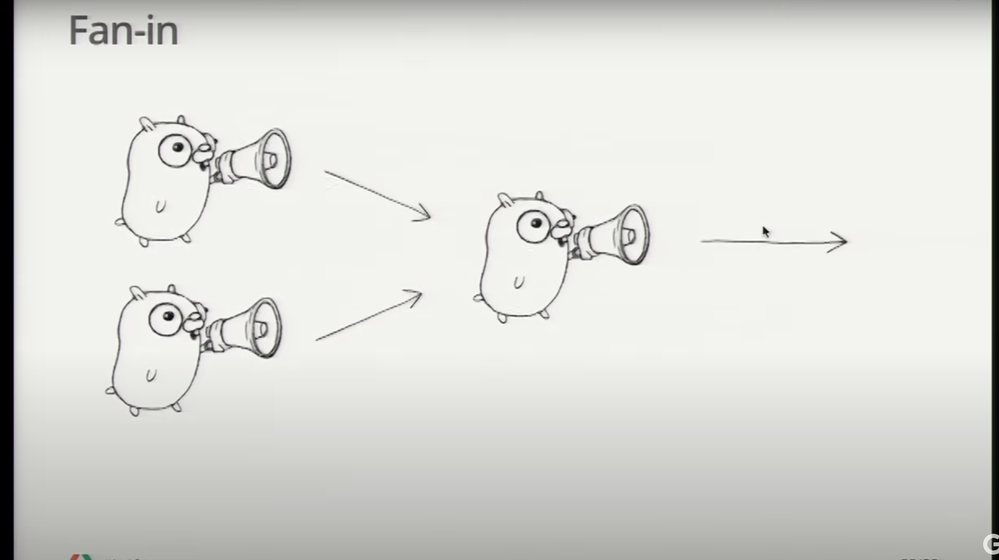
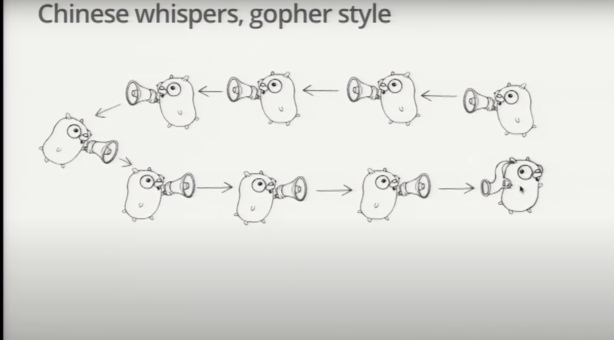

## Google I/O 2012- Go concurency patterns

Notes for the awesome talk given by Sir Rob Pike in the below video

[https://youtu.be/f6kdp27TYZs?si=aNjo1cX_hEtKHn03](https://youtu.be/f6kdp27TYZs?si=aNjo1cX_hEtKHn03)

## Generate: fn that returns a channel

- Channels are first-class values, just like strings or integers

```go
c := boring("boring") // function returning a channel

for i :=0; i < 5; i++{
    fmt.Println(<-c)
}
fmt.Println("You are boring, I am leaving")

func boring(msg string) <- chan string{ // Returns recieve-only channel of strings
    outStream := make(chan string)
    go func(){
    for i :=0 ; i++{
                c <- i
                time.Sleep(1*tjume.Mi)
    }
    }()
   return outStream
}

```

## Channels as a handle on a service

- Our boring fn returns a channel that lets us communicatre with the boring service it provides , We can have more instances of the service

```go
func main(){
    joe := boring("joe")
    ann := boring("ann")

    for i:=0; i <5; i++{
        fmt.Println(<-joe)
        fmt.Println(<-ann)
    }
    fmt.Println("All are boring leaving!!")
}
```

## Multiplexing

- These programs make Joe and Ann count in lockstep

- We can instead use a ``fan-in`` fn to let whoever is ready to talk

```go
func fanIn(ch1, ch2 <-chan string) <-chan string {
	ch := make(chan string)

	go func() {
		defer close(ch)
		for val := range ch1 {
			ch <- val
		}
	}()

	go func() {
		for val := range ch2 {
			ch <- val
		}
	}()
	return ch
}

func main(){
    c := fanIn(boring("Joe"),boring("ann"))
    for i := 0; i < 10; i++{
        fmt.Println(<-c)
    }
}
```


- Take input from multiple channels and multiplex the output into a single receivable channel.

## Restoring sequencing

- Send a channel on a channel making goroutine wait its turn

- Receive all messages, then enable them again by sending on a private channel

- First we define a message type that contains a channel for the reply

```go
type Message struct {
    str string
    wait chan bool
}

```

- Each speaker must wait for a goahead

```go
for i:=0 i < 5; i++{
    msg1 := <-c; fmt.Println(msg1.str)
    msg2 := <-c; fmt.Println(msg2.str)
    msg1.wait <- true
    msg2.wait <-true
}

waitForIt := make(chan bool)

c <- Message{"foo",waitForIt}
<- waitForIt
```
## Select

- A control structure that is unique to concurrency

- The statement provides another way to handle multiple channels, its like a switch but each case is communication.

- All channels are evaluated.

- Selection blocks until one communication can proceed, which then does.

- When multiple can proceed , Select chooses pseudo-randomly.

- A default clause, if present executes immediately if no channel is ready

```go
select {
    case v1 := <-c1:
    fmt.Println(v1)

    case v2:= <-c2:
        fmt.Println(v2)
    case c3<-23:
        fmt.Println("sent 23")
    default:
        fmt.Println("default case")
}
```

## Fan-in using select

- Rewrite our original fan-in fn , only one goroutine is needed

```go
func fanIn(inp1,inp2 <- chan string) <- chan string{
    ch := make(chan string)
    go func(){
        select {
            case s := inp1:
                ch <- s
            case s := inp2:
                ch <- s
        }
    }()

    return ch
}
```

## Timeout using select

- The ``time.After`` fn returns a channel that blocks for the specified duration . After the interval , the channel delivers the current time once

```go
func main(){
    c := boring("Joe")

    for {
        select {
            case s := <-c :
                fmt.Println(s)
            case <- time.After(1*time.Second):
                fmt.Println("too slow")
                return
        }
    }
}
```
## Timeout for whole convo using select

- Create the timer once , outside the loop , to time out the entire convo.

```go
func main(){
    c := boring("Joe")
    timeout := time.After(5*time.Second)

    for {
        select {
            case s := <-c:
                fmt.Println(s)
            case <- timeout:
                fmt.Println("Talk too much")
                return
        }
    }
}
```

## Quit Channel

- We can turn this around and tell Joe to stop when we are tired of listening to him

```go
quit := make(chan bool)
c := boring("Joe",quit)
for i := rand.Intn(10); i >=0 ; i--{
    fmt.Println(c)
}

select {
    case c <- i :

    case <-quit:
        return
}
```

## Receive on quit channel

How do we know when it is finished? Wait for it to tell us its done ,receive on the quit channel

```go
quit := make(chan string)
c := boring("Joe",quit)
quit <- "bye"
fmt.Println("Waiting for quit chan ",<-quit)

select {
    case c <- i :

    case <- quit:
        cleanup()
        quit <- "See you!"
        return
}
```



## Don't overdo it

- They are fun to play with but dont overuse these ideas.

- Goroutines and channels are big ideas, They are tools for program construction.

- But sometimes all we need is a reference counter.

- Go has ``sync`` and ``sync/aotmic`` packages that provide mutexes condition variables etc,  They provide tools for smaller problems.

- Always use the right tool for the job.

## Conclusions

- Goroutines and channels make it easy to express complex operations dealing with

- multiple inputs

- multiple outputs

- timeout

- failure
## Slides

[Slides](https://go.dev/talks/2012/concurrency.slide#1)